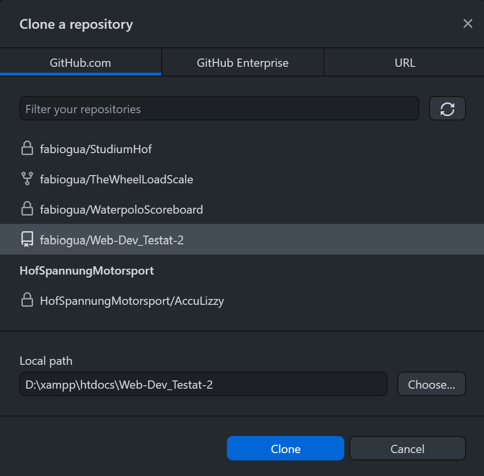
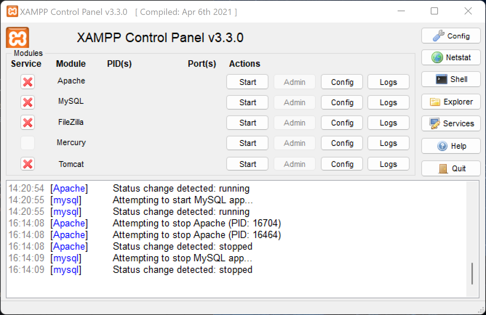

# Web-Dev_Testat-2

<!--
*** Thanks for checking out the Best-README-Template. If you have a suggestion
*** that would make this better, please fork the repo and create a pull request
*** or simply open an issue with the tag "enhancement".
*** Don't forget to give the project a star!
*** Thanks again! Now go create something AMAZING! :D
-->

<!-- PROJECT SHIELDS -->
<!--
*** I'm using markdown "reference style" links for readability.
*** Reference links are enclosed in brackets [ ] instead of parentheses ( ).
*** See the bottom of this document for the declaration of the reference variables
*** for contributors-url, forks-url, etc. This is an optional, concise syntax you may use.
*** https://www.markdownguide.org/basic-syntax/#reference-style-links
-->
[![Contributors][contributors-shield]][contributors-url]
[![Forks][forks-shield]][forks-url]
[![Stargazers][stars-shield]][stars-url]
[![Issues][issues-shield]][issues-url]
[![MIT License][license-shield]][license-url]

<!-- PROJECT LOGO -->
 

  

<h3 align="center">project_title</h3>

  

    project_description
    <a href="https://github.com/fabiogua/Web-Dev_Testat-2"><strong>Explore the docs »</strong></a>
     
     
    <a href="https://github.com/fabiogua/Web-Dev_Testat-2">View Demo</a>
    ·
    <a href="https://github.com/fabiogua/Web-Dev_Testat-2/issues">Report Bug</a>
    ·
    <a href="https://github.com/fabiogua/Web-Dev_Testat-2/issues">Request Feature</a>
  

<!-- TABLE OF CONTENTS -->

  
Table of Contents

  <ol>
    <li>
      <a href="#about-the-project">About The Project</a>
      <ul>
        <li><a href="#built-with">Built With</a></li>
      </ul>
    </li>
    <li>
      <a href="#getting-started">Getting Started</a>
      <ul>
        <li><a href="#prerequisites">Prerequisites</a></li>
        <li><a href="#installation">Installation</a></li>
      </ul>
    </li>
    <li><a href="#usage">Usage</a></li>
    <li><a href="#roadmap">Roadmap</a></li>
    <li><a href="#contributing">Contributing</a></li>
    <li><a href="#license">License</a></li>
    <li><a href="#contact">Contact</a></li>
    <li><a href="#acknowledgments">Acknowledgments</a></li>
  </ol>

<!-- ABOUT THE PROJECT -->
## About The Project
Web-Dev Testat 2

### Built With

* HTML
* CSS
* JavaScript

<!-- GETTING STARTED -->
## Getting Started

This is an example of how you may give instructions on setting up your project locally.
To get a local copy up and running follow these simple example steps.

### Prerequisites

Install [XAMPP](https://www.apachefriends.org/de/index.html)
  

### Download Repository
 
1. Clone repository to /xampp/htdocs/
  

  
 

 
  
  
2. Replace index.php in /xampp/htdocs/
  

  

 
 
3. Start Apache and mySQL
   

  
 

<!-- ROADMAP -->
## Roadmap

- [ ] Armin stinkt
- [ ] mySQL benutzen

See the [open issues](https://github.com/fabiogua/Web-Dev_Testat-2/issues) for a full list of proposed features (and known issues).

<!-- LICENSE -->
## License

Distributed under the MIT License. See `LICENSE.txt` for more information.

(<a href="#top">back to top</a>)

<!-- MARKDOWN LINKS & IMAGES -->
<!-- https://www.markdownguide.org/basic-syntax/#reference-style-links -->
[contributors-shield]: https://img.shields.io/github/contributors/fabiogua/Web-Dev_Testat-2.svg?style=for-the-badge
[contributors-url]: https://github.com/fabiogua/Web-Dev_Testat-2/graphs/contributors
[forks-shield]: https://img.shields.io/github/forks/fabiogua/Web-Dev_Testat-2.svg?style=for-the-badge
[forks-url]: https://github.com/github_username/repo_name/network/members
[stars-shield]: https://img.shields.io/github/stars/fabiogua/Web-Dev_Testat-2.svg?style=for-the-badge
[stars-url]: https://github.com/fabiogua/Web-Dev_Testat-2/stargazers
[issues-shield]: https://img.shields.io/github/issues/fabiogua/Web-Dev_Testat-2.svg?style=for-the-badge
[issues-url]: https://github.com/fabiogua/Web-Dev_Testat-2/issues
[license-shield]: https://img.shields.io/github/license/fabiogua/Web-Dev_Testat-2.svg?style=for-the-badge
[license-url]: https://github.com/fabiogua/Web-Dev_Testat-2/blob/master/LICENSE.txt
[product-screenshot]: images/screenshot.png
